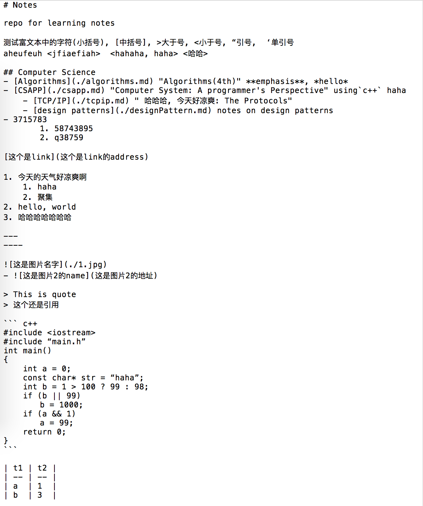
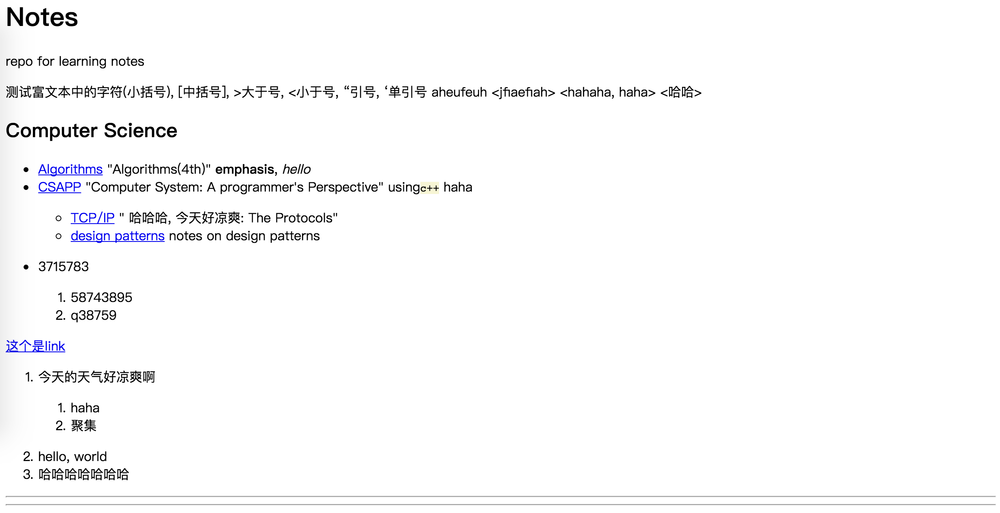
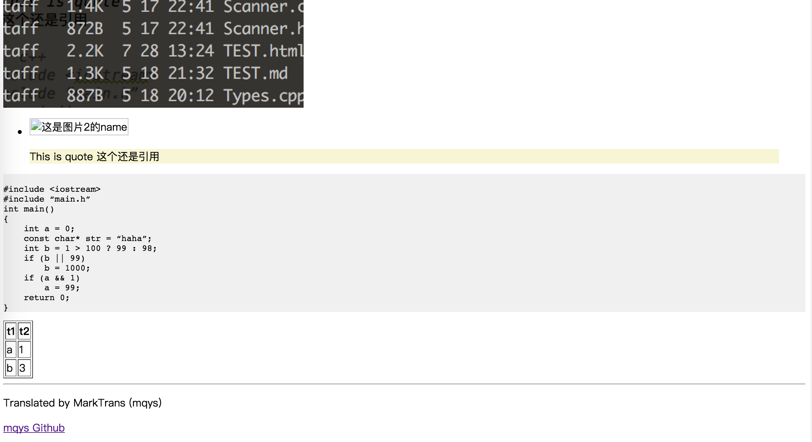

# MarkTrans
A markdown parser for translating markdown files to html files.

## Intro:
- Using recursive descent and regex to implement LL(k)
- Written in C++ 

## Request:
- cmake
- C++11 compiler

## Build:
```shell
mkdir build
cd build
cmake .. && make
```
## Usage:
```
./MarkTrans [-f] markdownfile
#   -f: write output to file
#   default: write output to console
```

## Supporting syntax
### Block Elements:
- Header
- Horizontal
- Blockquote
- Code block
- Table
- List
    - Ordered List
    - Unordered List
    
### Span Elements:
- Link
- Image
- Emphasis
- Code


## Demo:
see TEST.md and TEST.html in the demo folder

### Input raw markdown file


### Output html file

